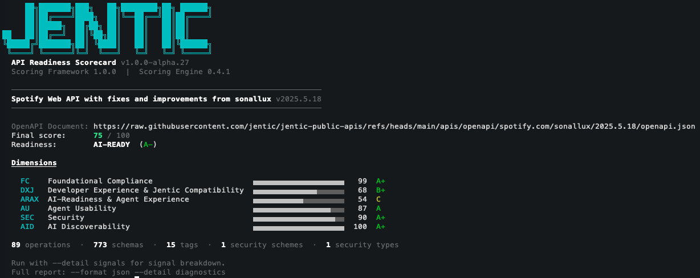

# You May Have OpenAPI, But Is It AI-Ready?

👋 This repository serves as a hands-on workshop companion.

This repo is for getting hands-on with real APIs and the Jentic Scoring CLI which accesses APIs for AI-readiness using the Jentic API AI-Readiness Framework (JAIRF.



**Quick links**
- Framework specification: https://docs.jentic.com/reference/api-readiness-framework/specification/
- Score in the browser (no install): https://jentic.com/scorecard
- Scoring CLI repo: https://github.com/jentic/jentic-api-scorecard
- Public API library (OAK): https://github.com/jentic/jentic-public-apis

---

## Pre-Flight Checklist

**Do this before the session.** The CLI runs the scoring engine inside Docker. First-run image pulls take a couple of minutes — do not leave this for the room.

### 1. Node.js 20 LTS or newer (>= 20.19.0)

```bash
node --version   # must be >= 20.19.0
```

Download from https://nodejs.org/ if needed.

### 2. Docker installed and running

```bash
docker info      # must return engine info, not an error
```

Download Docker Desktop from https://docs.docker.com/get-docker/ if needed. Start it before the session.

### 3. Pre-pull the scoring engine

Run this once before arriving — it pulls the Docker image so there's no wait on the day:

```bash
npx @jentic/api-scorecard-cli score \
  https://raw.githubusercontent.com/jentic/jentic-public-apis/refs/heads/main/apis/openapi/swagger-api/petstore/1.0.27/openapi.json
```

You should see a scorecard for the Swagger Petstore. If it completes without error, you're ready.

### 4. Optional: LLM API key

If you want to try LLM-enhanced signals during the session, have an API key for one of: OpenAI, Anthropic, Google Gemini, or AWS Bedrock. A local Ollama setup also works. See [LLM-Enhanced Signals](#llm-enhanced-signals-optional) below.

---

## Setting Up the CLI

### Option A: Global install (recommended for the workshop)

```bash
npm install -g @jentic/api-scorecard-cli@latest
```

Verify:

```bash
jentic-api-scorecard --version
```

### Option B: Zero-install with npx

Every command in this guide works with `npx @jentic/api-scorecard-cli@latest` in place of `jentic-api-scorecard`. No install needed, but it checks for updates on each invocation.

```bash
npx @jentic/api-scorecard-cli@latest --version
```

---

## UI Alternative

No Docker? No Node.js? Use the browser-based scorer:

**https://jentic.com/scorecard**

Paste a URL or drop a file. Same scoring engine, same results. Full signal breakdown is available after free registration.

---

## Registration & API Key

### Register and create your key

1. Go to **https://jentic.com/scorecard?tab=api-keys**
2. Sign in (or sign up for a free account)
3. Click to the **Score** option in the top nav, and click **CLI & Keys**
4. Click **Create Key**, give it a _Name_, select an _Expiration_, and _Slide to create key_
4. Copy your key and export it in your terminal/shell:

```bash
export JENTIC_API_KEY=your-key-here
```

Registration also unlocks full diagnostic detail in the web UI — per-signal evidence, improvement recommendations, and score history.

### When you need a key

URLs from the [Jentic Public API library (OAK)](https://github.com/jentic/jentic-public-apis) score without any key. For everything else — local files and your own API URLs — the key is required.

### Fallback

If registration hits a snag on the day, the workshop presenter has a shared key as a backup.

---

## LLM-Enhanced Signals (Optional)

Add `--with-llm` to unlock semantic analysis — whether descriptions are actionable for agents, whether error responses support autonomous recovery, and more. Requires an LLM provider.

### OpenAI

```bash
export OPENAI_API_KEY=sk-...
export LLM_PROVIDER=OPENAI
export LIGHT_LLM_PROVIDER=OPENAI
export LLM_LIGHT_MODEL=gpt-4o-mini

jentic-api-scorecard score samples/petstore.json --with-llm
```

### Anthropic

```bash
export ANTHROPIC_API_KEY=sk-ant-...
export LLM_PROVIDER=ANTHROPIC
export LIGHT_LLM_PROVIDER=ANTHROPIC
export LLM_LIGHT_MODEL=claude-haiku-4-5-20251001

jentic-api-scorecard score samples/petstore.json --with-llm
```

### Local (Ollama — free, nothing leaves your machine)

```bash
docker run -d --name ollama -p 11434:11434 ollama/ollama
docker exec ollama ollama pull llama3.1:8b

export LLM_PROVIDER=OPENAI
export LIGHT_LLM_PROVIDER=OPENAI
export OPENAI_API_URL=http://localhost:11434/v1/chat/completions
export OPENAI_API_KEY=ollama
export LLM_MODEL=llama3.1:8b
export LLM_LIGHT_MODEL=llama3.1:8b

jentic-api-scorecard score samples/petstore.json --with-llm
```

Full provider reference and troubleshooting: https://github.com/jentic/jentic-api-scorecard/blob/main/docs/llm-signals.md

> **Note:** LLM scores are not directly comparable to non-LLM runs. The same spec may score differently with `--with-llm` because the LLM-derived signals contribute to dimension and overall scores. Run consistently with or without the flag when comparing.

---

## Exercises

### Exercise 1 — Install and verify

Install the CLI (or confirm npx works) and score the Petstore to verify your setup:

```bash
jentic-api-scorecard --version

jentic-api-scorecard score \
  https://raw.githubusercontent.com/jentic/jentic-public-apis/refs/heads/main/apis/openapi/swagger-api/petstore/1.0.27/openapi.json
```

The Petstore is one of the most-referenced OpenAPI examples in existence. It scores **B+ (68.6)**. That's the thesis of this session in one number.

---

### Exercise 2 — Score APIs from the public library

The [Jentic Public API Library (OAK)](https://github.com/jentic/jentic-public-apis) contains thousands of scored APIs. OAK URLs score without any key.

**A few starting points:**

```bash
# Lufthansa Public API (B, 66.5)
jentic-api-scorecard score \
  https://raw.githubusercontent.com/jentic/jentic-public-apis/refs/heads/main/apis/openapi/lufthansa.com/public/1.0/openapi.json

# Revolut Merchant API (B-, 60.9) — spec_validity fails, 45% of examples invalid
jentic-api-scorecard score \
  https://raw.githubusercontent.com/jentic/jentic-public-apis/refs/heads/main/apis/openapi/revolut.com/merchant/2024-09-01/openapi.json

# Dropbox Sign API (C, 53.7) — 710 examples, 90% fail schema validation
jentic-api-scorecard score \
  https://raw.githubusercontent.com/jentic/jentic-public-apis/refs/heads/main/apis/openapi/dropbox.com/dropbox-sign-api/3.0.0/openapi.json

# DigitalOcean API (C, 54.0) — 589 operations, strong response coverage, weak overall
jentic-api-scorecard score \
  https://raw.githubusercontent.com/jentic/jentic-public-apis/refs/heads/main/apis/openapi/docs.digitalocean.com/main/2.0/openapi.json
```

**Browse and pick your own:**

OAK is organised as `apis/openapi/<vendor>/<api>/<version>/openapi.json`. Browse the repo and construct the raw GitHub URL for any API that interests you. Each directory also contains a `scorecard.json` if you want to preview scores before running the CLI.

> ❕ Quick Tip: Use the _Quick Access Index_ to find your preferred API vendor alphabetically - see [Jentic Public APIs (OAK)](https://github.com/jentic/jentic-public-apis).

---


### Exercise 3 — Score local files

> Here you'll need to get a CLI/API Key from Jentic

#### Register and create your key (if not already done)

1. Go to **https://jentic.com/scorecard?tab=api-keys**
2. Sign in (or sign up for a free account)
3. Click to the **Score** option in the top nav, and click **CLI & Keys**
4. Click **Create Key**, give it a _Name_, select an _Expiration_, and _Slide to create key_
4. Copy your key and export it in your terminal/shell:

```bash
export JENTIC_API_KEY=your-key-here
```

This repo includes five sample OpenAPI files in the `samples/` directory, each with a different profile.

🟢 ai-ready &nbsp;&nbsp; 🟡 ai-aware &nbsp;&nbsp; 🟠 foundational &nbsp;&nbsp; 🔴 not-ready

| File | API | | Score | Level | Notable |
|------|-----|-|-------|-------|---------|
| `petstore.json` | Swagger Petstore v3 | 🟡 | 68.6 (B+) | ai-aware | FC 99.5% yet ARAX only 55% (C) and SEC 43% (D-) — the canonical "valid ≠ ready" example |
| `spotify.json` | Spotify Web API | 🟢 | 75.1 (A-) | ai-ready | FC 99%, SEC 90%, AID 100% — yet ARAX still only 54% (C). Best recognizable score in the dataset |
| `box.json` | Box Platform API | 🟡 | 68.8 (B+) | ai-aware | Strongest ARAX in the set at 80% (A). AU drags at 43% (D-) — the cost of 296 operations |
| `shopify.json` | Shopify REST Admin API | 🟠 | 58.2 (C+) | foundational | spec_validity fails. Zero examples across 273 operations. Under half of operations have descriptions |
| `slack.json` | Slack Web API | 🟠 | 51.3 (C-) | foundational | ARAX scores F (27.5%). summary_coverage: 0.00 — not one of 169 operations has a summary |

Set your key, then score them:

```bash
export JENTIC_API_KEY=your-key-here

jentic-api-scorecard score samples/petstore.json
jentic-api-scorecard score samples/spotify.json
jentic-api-scorecard score samples/box.json
jentic-api-scorecard score samples/shopify.json
jentic-api-scorecard score samples/slack.json
```

**Use `--detail` to zoom in:**

```bash
# Headline grade only
jentic-api-scorecard score --detail summary samples/petstore.json

# Per-dimension breakdown (default)
jentic-api-scorecard score --detail dimensions samples/petstore.json

# Individual signals within each dimension
jentic-api-scorecard score --detail signals samples/petstore.json

# Full diagnostics — what exactly is failing and why
jentic-api-scorecard score --detail diagnostics samples/petstore.json
```

This progression — summary → dimensions → signals → diagnostics — is how you diagnose and prioritise improvements in practice.

---

### Exercise 4 — Score your own API

Score your company's API, a personal project, or any publicly accessible OpenAPI document.

```bash
# Your own OpenAPI file
jentic-api-scorecard score path/to/your/openapi.yaml

# A remote OpenAPI document
jentic-api-scorecard score https://your-api-host.com/openapi.json
```

If you don't have an API handy, a few publicly accessible canonical specs worth trying:

```bash
# OpenAI API — official spec, 242 ops, scores C- (52.2)
jentic-api-scorecard score \
  https://raw.githubusercontent.com/openai/openai-openapi/master/openapi.yaml

# GitHub REST API — official spec, 1,186 ops, scores D- (40.2) — allow ~40s to score
jentic-api-scorecard score \
  https://raw.githubusercontent.com/github/rest-api-description/main/descriptions/api.github.com/api.github.com.json
```

Use `--detail signals` on whatever you score — find the dimension with the most obvious gap, and carry that into Exercise 5.

---

### Exercise 5 - Setup and use our Agent Skill for Claude Code

The [Jentic API Scorecard repository](https://github.com/jentic/jentic-api-scorecard) ships a versioned [agent skill](https://github.com/jentic/jentic-api-scorecard/blob/main/skills/jentic-api-scorecard/SKILL.md) that teaches AI coding agents how to use the CLI correctly — installing it, scoring files and URLs, producing JSON/HTML, wiring it into CI, enabling LLM analysis, and interpreting exit codes. Install it through whichever path fits your agent.

#### Claude Code Setup

[Claude Code](https://docs.claude.com/en/docs/claude-code/overview) users install it
as a [plugin](https://docs.claude.com/en/docs/claude-code/plugins) — this repository
doubles as a plugin marketplace:

```
/plugin marketplace add jentic/jentic-api-scorecard
/plugin install api-scorecard@jentic-api-scorecard
```

Once installed, the skill loads automatically when you ask Claude to score an OpenAPI document —
no explicit invocation needed:

```
> Score ./openapi.yaml for AI-readiness
> How AI-ready is https://petstore3.swagger.io/api/v3/openapi.json?
```

To force it into context regardless of phrasing, invoke it explicitly with
`/api-scorecard:jentic-api-scorecard`.


### Exercise 6 — Improve a dimension by 10%+

Pick one of the sample files (the Petstore is the best starting point — small enough to edit), open it in any text editor, make targeted changes, and re-score to verify the improvement.

**Goal:** improve any single dimension score by 10 percentage points or more.

#### High-impact, low-effort fixes by dimension

**Foundational Compliance (FC)**
- `spec_validity` failing? Run the file through [Redocly CLI](https://redocly.com/docs/cli/) (`redocly lint`) or paste into https://editor.swagger.io — fix the reported errors, then rescore.
- `structural_integrity` issues show up under `--detail diagnostics`. Each fix is usually a missing required field or a schema type mismatch.

**Developer Experience (DXJ)**
- `example_density` — Add an `example` field to 3–5 request body schemas or response schemas. Even a minimal realistic object makes a measurable difference on a small spec.
- `example_validity` — Run `--detail diagnostics` to see which examples are failing schema validation. The most common cause: missing required fields in the example object. Fix the example to match the schema.
- `response_coverage` — Add 4XX and 5XX response definitions to operations that only declare 200. Minimum viable: add a `400` and a `500` with a basic schema.

**AI-Readiness & Agent Experience (ARAX)**
- `description_coverage` — Add a `description` field to operations, parameters, or schema properties that are missing one. On the Petstore, 40% of operations have no description. Five additions will move the needle.
- `summary_coverage` — Add a `summary` field to any operation that has a description but no summary. Summaries are the one-liner an agent reads first — keep them to a single action phrase (e.g. `"Create a new pet"`, not `"This endpoint creates..."`).
- `error_standardization` — Add an `application/problem+json` response schema to error responses, following [RFC 9457 Problem Details](https://www.rfc-editor.org/rfc/rfc9457.html). Even one operation moving to RFC 9457 will push a previously-zero signal off zero.

**Suggested workflow:**

```bash
# Baseline
jentic-api-scorecard score --detail signals samples/petstore.json

# Edit samples/petstore.json — add descriptions to 5 operations
# (keep the original, work on a copy if you prefer)

# Re-score
jentic-api-scorecard score --detail signals samples/petstore.json
```

The signal scores are decimal (0–1) and the dimension scores are percentages. A 0.20 → 0.40 move on `description_coverage` across 19 operations translates to a visible ARAX dimension jump.

---

## Sample Files

| File | API | Ops | | Score | Level | Source |
|------|-----|-----|-|-------|-------|--------|
| `petstore.json` | Swagger Petstore v3 | 19 | 🟡 | 68.6 (B+) | ai-aware | [OAK](https://github.com/jentic/jentic-public-apis/tree/main/apis/openapi/swagger-api/petstore/1.0.27) |
| `spotify.json` | Spotify Web API | 89 | 🟢 | 75.1 (A-) | ai-ready | [OAK](https://github.com/jentic/jentic-public-apis/tree/main/apis/openapi/spotify.com/sonallux/2025.5.18) |
| `box.json` | Box Platform API | 296 | 🟡 | 68.8 (B+) | ai-aware | [OAK](https://github.com/jentic/jentic-public-apis/tree/main/apis/openapi/box.com/main/2024.0) |
| `shopify.json` | Shopify REST Admin API | 273 | 🟠 | 58.2 (C+) | foundational | [OAK](https://github.com/jentic/jentic-public-apis/tree/main/apis/openapi/shopify.com/main/2025-01) |
| `slack.json` | Slack Web API | 169 | 🟠 | 51.3 (C-) | foundational | [OAK](https://github.com/jentic/jentic-public-apis/tree/main/apis/openapi/slack.com/main/1.7.0) |

All files are sourced from the [Jentic Public API Library](https://github.com/jentic/jentic-public-apis) and are unmodified from their OAK versions.
